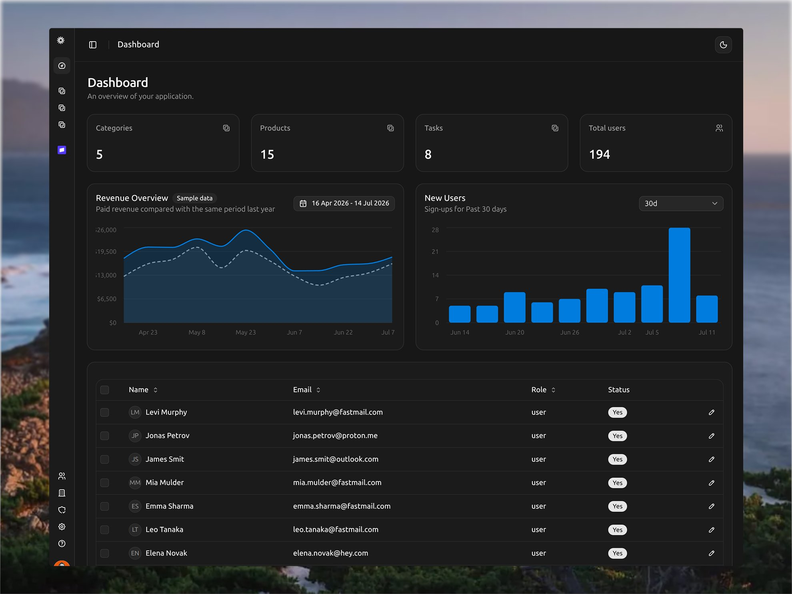
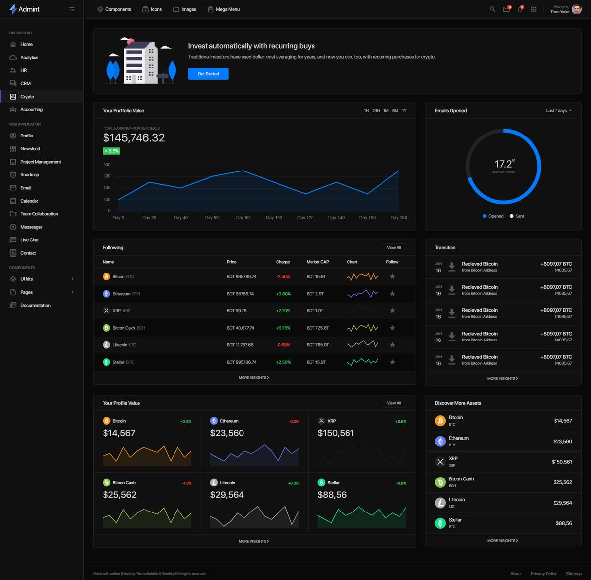
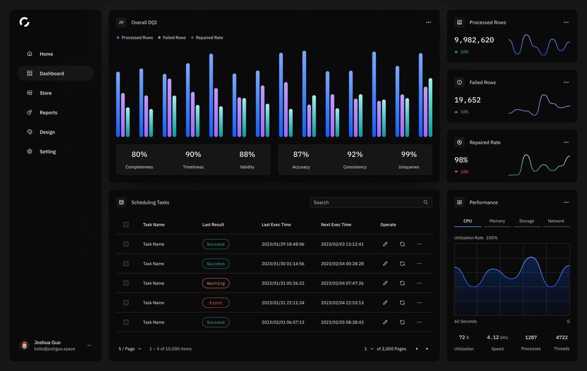
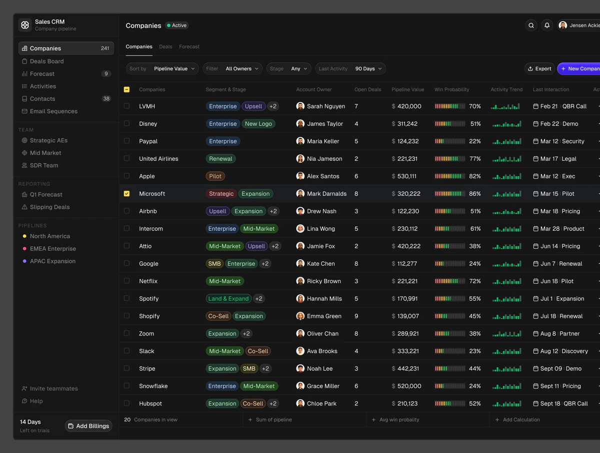
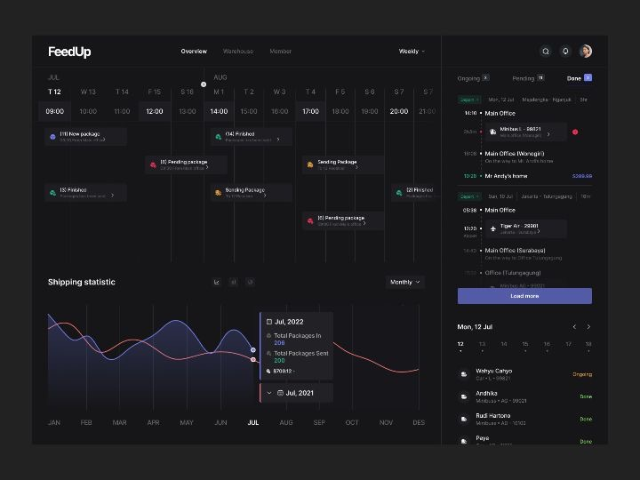
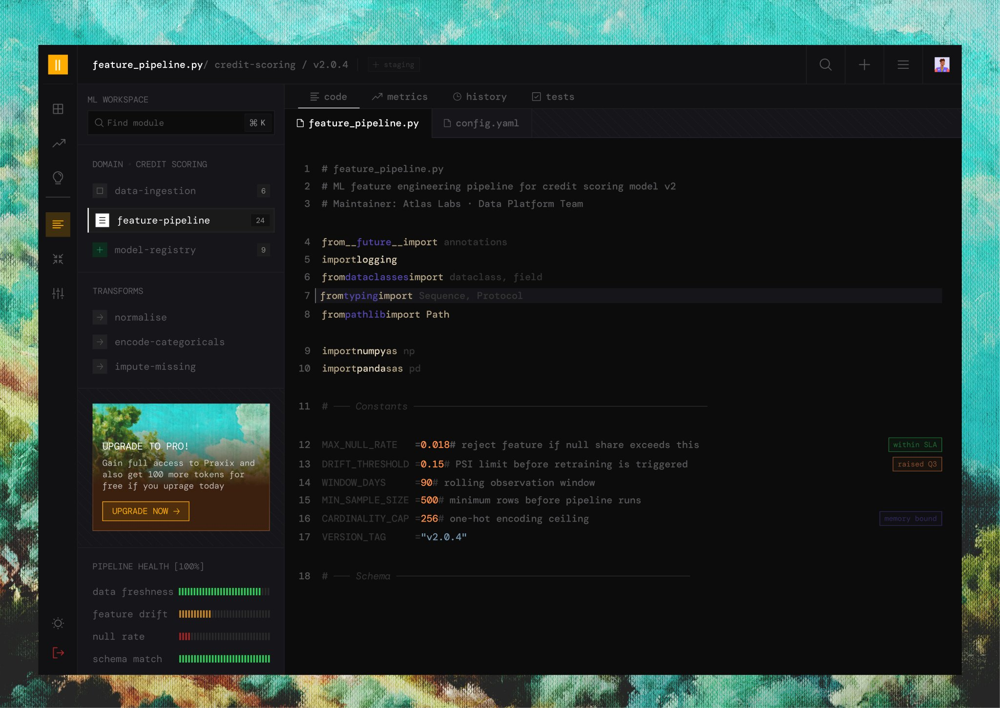
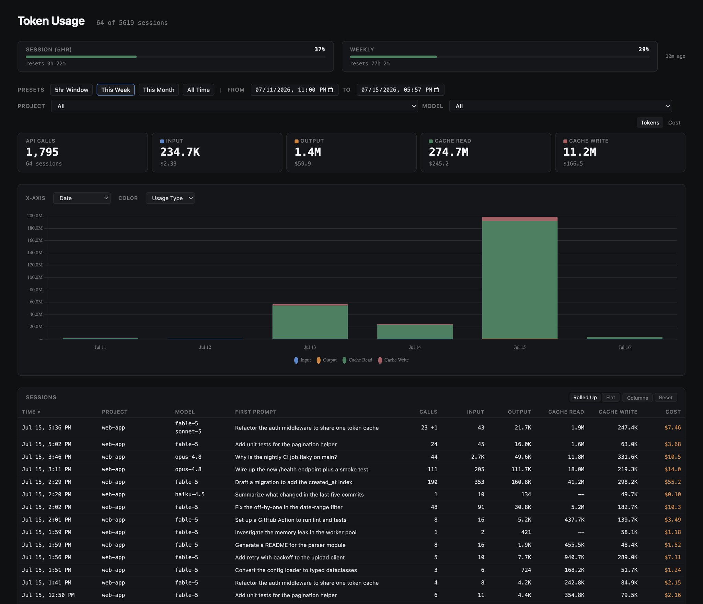
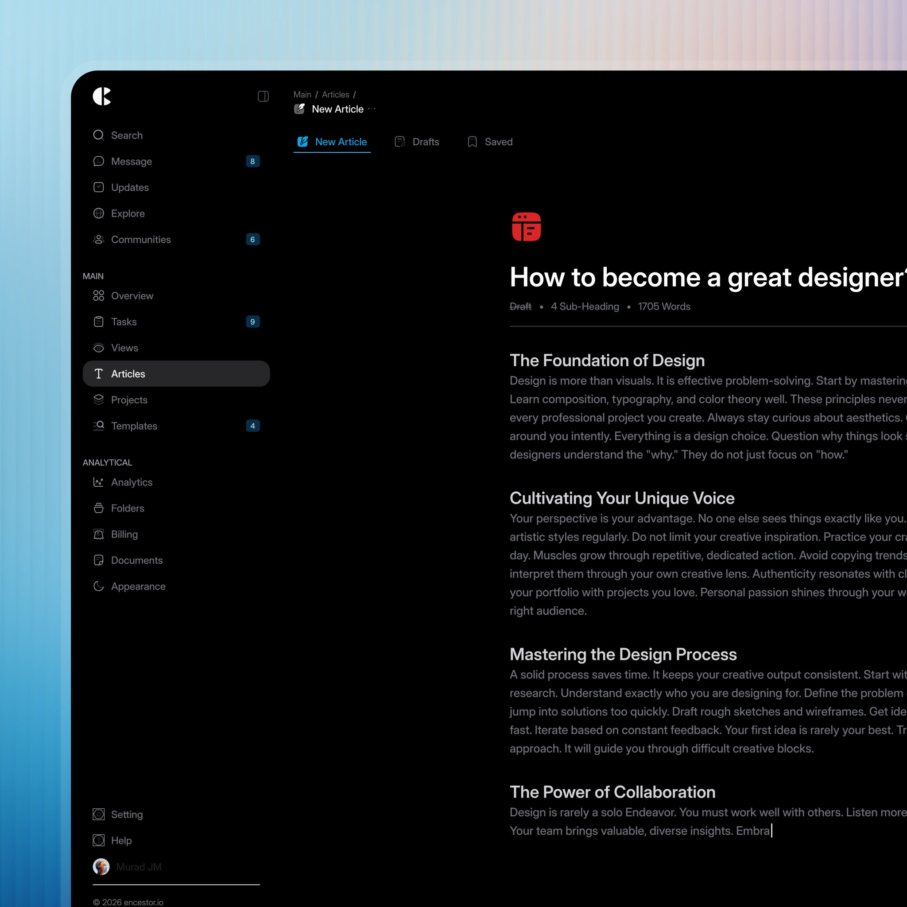

# Build Precision Dashboard UI

A Codex UI-building skill for producing dense, reference-faithful enterprise dashboards without drifting into generic SaaS styling.

The bundled visual language is best described as **precision dark enterprise dashboard UI**, also known as **dark SaaS operations UI** or **control-room UI**.

## Style characteristics

- Near-black layered surfaces
- Hairline borders and restrained shadows
- Dense desktop-first layouts
- Compact typography and controls
- Persistent sidebars, split panes, inspectors, tables, maps, and charts
- One product accent with sparse semantic status colors
- Precise alignment and realistic operational data
- Light mode only when requested or inherited from an existing product

This is not glassmorphism, cyberpunk, or a soft consumer-dashboard aesthetic. The skill rejects neon glow, decorative gradients, oversized cards, excessive pills, giant headings, broad empty spaces, and unrelated visual motifs.

## Samples

| Analytics dashboard | Crypto admin dashboard | Data-quality dashboard |
|---|---|---|
| [](samples/01-analytics-dashboard.jpeg) | [](samples/02-crypto-admin-dashboard.jpeg) | [](samples/03-data-quality-dashboard.jpeg) |

| Sales CRM table | Logistics schedule | Three-pane inbox |
|---|---|---|
| [](samples/04-sales-crm-table.jpeg) | [](samples/05-logistics-schedule-dashboard.jpeg) | [](samples/06-three-pane-inbox.jpeg) |

| Engineering console | Token usage | Editor workspace |
|---|---|---|
| [](samples/07-engineering-console.jpeg) | [](samples/08-token-usage-dashboard.jpeg) | [](samples/09-editor-workspace.jpeg) |

## What the skill does

The skill requires Codex to:

1. Inspect the bundled inspiration images before designing.
2. Choose one primary reference based on the product's information architecture.
3. Use no more than two supporting references for missing patterns.
4. Preserve the project's framework, behavior, routes, and data flow.
5. Build the macro layout before styling individual components.
6. Apply a shared token system instead of scattered one-off CSS.
7. Pass both code validation and rendered screenshot comparison before claiming completion.

The colorful or textured backgrounds surrounding some reference applications are treated as presentation framing—not as part of the product UI.

## Included layout archetypes

| Archetype | Suitable products |
|---|---|
| Three-pane workspace | Inbox, CRM, issue tracking, task detail |
| Analytics dashboard | BI, usage, billing, product metrics |
| Dense task table | Project management, admin, work queues |
| Engineering console | IDE, ML platform, pipeline tooling |
| Operations map | Monitoring, security, incident response |
| Fleet map | Logistics, dispatch, route tracking |
| Editor workspace | Writing, documents, knowledge tools |
| Light monitoring | Light-mode observability and tracing |

## Usage

Invoke the skill directly:

```text
Use @build-precision-dashboard-ui to build a desktop network-operations dashboard.
```

It can also repair an existing interface:

```text
Use @build-precision-dashboard-ui to restyle this dashboard and fix its visual drift without breaking existing behavior.
```

## Installation

The repository root is the complete skill folder. Clone it into a skills location or import the repository as a personal skill:

```bash
git clone https://github.com/pierrebw/UISKILL.git build-precision-dashboard-ui
```

The required `SKILL.md` and UI metadata are already included.

## Repository structure

```text
UISKILL/
├── SKILL.md
├── agents/
│   └── openai.yaml
├── assets/
│   ├── inspiration/
│   │   └── 01–09 reference images
│   └── precision-ui-tokens.css
├── samples/
│   └── 01–09 example interfaces
└── references/
    ├── layout-archetypes.md
    ├── style-system.md
    └── visual-qa.md
```

## Fidelity gates

Completion requires two independent gates:

- **Code gate:** typecheck, lint, tests, build, interaction checks, overflow, focus, and accessibility.
- **Visual gate:** render at the target viewport, capture a screenshot, compare against the primary reference, and repair mismatches in topology, proportion, density, surfaces, typography, controls, and data visualization.

A successful build alone is not considered proof that the interface matches the inspiration.
